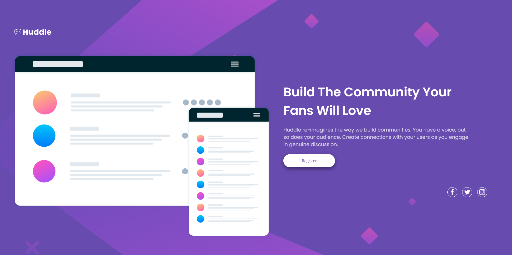

## Table of contents

- [Overview](#overview)
  - [The challenge](#the-challenge)
  - [Screenshot](#screenshot)
  - [Links](#links)
- [My process](#my-process)
  - [Built with](#built-with)
  - [What I learned](#what-i-learned)
  - [Continued development](#continued-development)
  - [Useful resources](#useful-resources)
- [Author](#author)
- [Acknowledgments](#acknowledgments)

## Overview

Created NEWBIE huddle landing page

### The challenge

hover over social media icons changing color

### Screenshot

### Links

- GITHUB REPO: [https://github.com/MrRo-bot/huddle-landing-page-with-single-introductory-section]
- Solution URL: [https://codepen.io/Mr-RO13OT/full/oNBPZVy]

## My process

- Taking a proper look and formulating plans for making the design,
- HTML skeleton with HTML Boilerplate containing default modernizer and normalizer CSS properties,
- Finalising HTML skeleton,
- Typography,
- Alignments and furthur designing,
- Finalising everything and solving existing problems,
- Testing in all screens and making Media Queries if necessary,
- Deployment and Cross-Testing.

### Built with

- Semantic HTML5 markup,
- CSS custom properties,
- Flexbox,
- Mobile-first workflow,
- Pseudo-classes and pseudo-element.

### What I learned

- Switching between two Images using :hover,
- Getting better on aligment and giving spaces between elements and using viewport units when necessary,
- Getting more practice on Mobile-first layouts.

### Continued development

- Giving some thought to Accessibility and backward compatibility.

### Useful resources

- Mozilla Docs: (https://developer.mozilla.org/en-US/docs/Learn)

## Author

- Website - [@MrRobot](https://github.com/MrRo-bot)
- Frontend Mentor - [@MrRobot](https://www.frontendmentor.io/profile/MrRo-bot)

## Acknowledgments

This project is entirely made by me only
